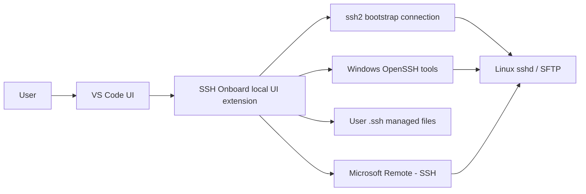
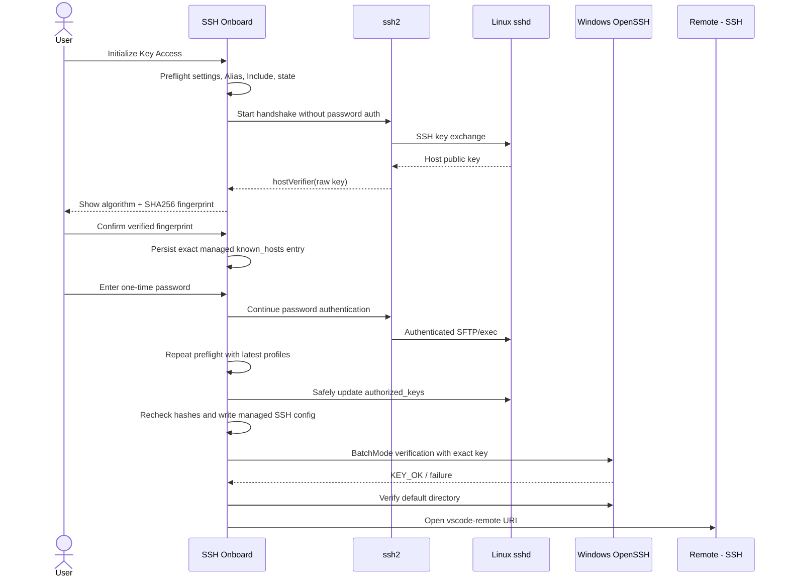

# SSH Onboard 技术架构设计

## 1. 架构原则

1. **薄扩展**：只处理首次密钥引导与主机管理，不复制 Remote - SSH 能力。
2. **本地优先**：扩展固定运行在本地 UI Extension Host，不读取远程工作区代码。
3. **混合 SSH 实现**：`ssh2` 仅负责首次密码引导；系统 OpenSSH 负责密钥生成、最终验证和日常连接。
4. **最小修改面**：本地只向主 SSH Config 增加一条 Include，远端只更新标准用户的 `authorized_keys`。
5. **安全失败**：指纹、配置、权限或并发状态不确定时中止，不自动绕过。
6. **适配器隔离**：Remote - SSH 启动方式封装在单一模块，避免非公开集成细节扩散。

## 2. 系统上下文



扩展 Manifest 必须声明本地运行，并把 Remote - SSH 放入扩展包推荐列表，但不使用会阻止本扩展独立激活的硬依赖：

```json
{
  "extensionKind": ["ui"],
  "extensionPack": ["ms-vscode-remote.remote-ssh"]
}
```

只通过命令和 View 激活，不使用 `*` 或 `onStartupFinished`。运行时通过 `vscode.extensions.getExtension()` 做软检测；Remote - SSH 缺失或禁用时，服务器管理和密钥初始化仍可用，只有打开远程目录的命令被禁用并显示安装/启用指引。

## 3. 模块划分

```text
src/
  extension.ts
  domain/
    profiles.ts
    keys.ts
    trust.ts
    errors.ts
  services/
    profileStore.ts
    hostTrustService.ts
    keyManager.ts
    bootstrapClient.ts
    authorizedKeysService.ts
    sshConfigService.ts
    verificationService.ts
    remoteSshLauncher.ts
  providers/
    serverTreeProvider.ts
  commands/
    addHost.ts
    initializeHost.ts
    connectHost.ts
    editHost.ts
    revokeKey.ts
    showDiagnostics.ts
  platform/windows/
    openssh.ts
    fileAcl.ts
    processRunner.ts
  test/
```

模块依赖方向为 `commands/providers → services → domain`。平台调用只出现在 `platform/windows`，SSH/文件系统副作用通过接口注入，单元测试使用假实现。

## 4. 本地持久化

### 4.1 VS Code 状态

- `context.globalState`：版本化主机资料、分组、密钥引用和最后验证结果。
- 不调用 `setKeysForSync`，避免服务器清单通过 Settings Sync 扩散。
- `context.secrets`：V0.1 不使用；服务器密码和私钥口令永不持久化。

### 4.2 SSH 文件

```text
%USERPROFILE%\.ssh\
  config                         # 用户文件，只增加一次 Include
  ssh-onboard\
    config                       # 扩展拥有的 Host 块
    known_hosts                  # 扩展确认过的主机密钥
    state.json                   # V1 受管文件 SHA-256 基线
    keys\
      <key-id>_ed25519
      <key-id>_ed25519.pub
```

主配置中的唯一受管行：

```sshconfig
Include ssh-onboard/config
```

Include 必须位于首个 `Host`/`Match` 块之前，因为 OpenSSH 对多数选项采用“首先获得的值生效”。修改前生成时间戳备份、加互斥锁、记录原文件 hash；写入前再次比对 hash，发现并发编辑立即中止。

受管 Host 示例：

```sshconfig
# BEGIN ssh-onboard:<profile-id>
Host example-host
    HostName 192.0.2.10
    User developer
    Port 22
    IdentityFile ~/.ssh/ssh-onboard/keys/<key-id>_ed25519
    IdentitiesOnly yes
    PreferredAuthentications publickey
    PasswordAuthentication no
    KbdInteractiveAuthentication no
    UserKnownHostsFile ~/.ssh/ssh-onboard/known_hosts
    StrictHostKeyChecking yes
    UpdateHostKeys no
# END ssh-onboard:<profile-id>
```

主配置保留原 BOM、换行风格、注释与原始字节；不支持的编码或无法可靠替换时安全中止。受管配置采用 UTF-8 无 BOM、LF 和原子替换。每次更新后执行 `ssh -F <config> -G <alias>` 验证实际展开值。

首次保存主机信任时，扩展在同一个带所有权 token 的锁内，按顺序创建空的受管 `config`、写入 `known_hosts`，最后写入 V1 `state.json`。这是“同锁、state 最后写的可恢复提交”，不是跨三个文件的真正原子事务。V1 state 同时记录由 ProfileStore 路径派生的不可逆 authority hash；另一个 VS Code Profile 不得接管或覆盖同一受管 SSH 路径。旧 V1 state 仅在两个受管文件都与当前 ProfileStore 渲染结果逐字节一致时才能绑定 authority。

自动恢复仅接受 Preview.2 遗留的“精确且非空的 `known_hosts`，缺失 state，受管 config 缺失且期望内容为空”。普通运行时失败会在持锁期间按预期内容复核后回滚已完成的 rename。任意一字节差异、损坏 state、无 state 的其他布局、符号链接或应为非空却缺失的 config 都零写入失败。

## 5. 首次初始化数据流



`ssh2.hostVerifier` 必须配置，禁止使用其默认自动接受行为。回调发生在用户认证前；密码只有在指纹通过后才交给连接对象。

## 6. 主机信任

首次握手从服务端原始 host key 计算：

- 算法名称；
- `SHA256:<base64>` 指纹；
- OpenSSH `known_hosts` 所需的公钥数据。

用户界面提供两种核验方式：

1. 基础模式：展示指纹，用户确认已通过云控制台或管理员独立核对。
2. 高级模式：预先粘贴期望指纹，扩展做精确匹配。

非 22 端口用 `[hostname]:port` 写入。已信任主机的 key 发生变化时必须硬失败，不提供“一键忽略”；用户只能在查看旧/新指纹并重新带外核验后执行 Replace Trusted Host Key。V0.1 固定 `UpdateHostKeys no`，不会自动学习服务器声明的其他主机密钥；未来如支持轮换，必须为每一把新增 key 单独展示、带外确认并原子更新，不能静默扩大信任集合。

## 7. 密钥管理

### 7.1 生成密钥

默认通过参数数组调用系统 `ssh-keygen.exe` 生成 Ed25519；不使用 Shell 拼接。目标路径使用随机内部 key ID，使用 `O_EXCL`/存在性检查，绝不覆盖已有文件。

默认无口令密钥的风险通过三项措施收敛：

- 每主机独立，不默认复用或加入 agent；
- Windows ACL 只允许当前用户和系统必要主体访问；
- 只对本次新建的受管目录设置 ACL；已存在目录仅验证，不自动接管或改权限；
- UI、文档和撤销流程明确私钥等同登录凭据。

### 7.2 已有与共享密钥

- 未加密已有私钥：用 `ssh-keygen -y` 派生公钥并核对指纹。
- V0.1 的已有密钥模式只接受可由 `ssh-keygen -y` 无交互读取的私钥；加密私钥和 agent-backed 身份推迟到后续版本，避免验证链与 `IdentityAgent none` 的隔离策略冲突。
- 共享组密钥：Group 保存唯一 key reference；变更前展示所有受影响主机，轮换需要逐台验证成功后才更新状态。

## 8. `authorized_keys` 更新

V0.1 只操作当前普通 Linux 用户的 `$HOME/.ssh/authorized_keys`。流程：

1. 通过固定命令获取 Home 与 UID；用户输入不进入命令文本。Home 必须验证为绝对 POSIX 路径并保存为 `resolvedHome`。
2. 使用 SFTP `lstat` 拒绝符号链接、非普通文件、非当前用户所有的目标。
3. 确保 `.ssh` 为 0700，文件为 0600；不存在时按 `umask 077` 创建。
4. 以原子 `mkdir` 创建 `.ssh-onboard.lock`；锁存在则安全中止，不强拆。
5. 原样读取已有文件并记录内容 hash、大小和修改时间，按 key fingerprint 去重。已有受限或非受限同指纹 key 均视为已存在，不追加副本，并将授权标记为 `external`，禁用扩展撤销。
6. 需要追加时生成不可预测的 deployment ID，在同目录创建独占临时文件，逐字保留原内容，仅在必要时补换行，再追加规范化的 `keytype base64 ssh-onboard:<profile-id>:<deployment-id>`；同时保存规范化完整行、marker 和 fingerprint。
7. rename 前重新读取目标并核对内容 hash、大小和修改时间；任何变化都删除临时文件并中止。未变化时 flush、chmod 0600 并同目录 rename 替换；中途失败保留原文件。
8. 释放锁并执行指定密钥验证。

公钥 comment 由扩展生成，任何显示名、目录或用户输入都不得进入 Shell。私有锁只协调本扩展实例；hash/元数据复核只能检测已发生的外部变化，不能消除复核与 rename 之间的外部竞态。因此 V0.1 对外部管理员或其他工具同时修改 `authorized_keys` 不作无损保证，检测到变化时保守中止。标准文件系统之外的 ACL、xattr、NFS 和自定义 SELinux 行为不在 V0.1 保证范围内。

验证失败时不自动删除刚添加的 key；界面报告“部署完成但验证失败”，并在授权归属为 `managed` 时提供显式撤销。撤销前重新读取文件，且只有 marker、fingerprint、key blob 与保存的规范化完整行唯一匹配时才删除；不存在、重复或任何歧义都硬失败。`external` 授权永不由扩展撤销。

## 9. 密钥验证

最终验证必须调用系统 OpenSSH，并生成一次性隔离的最小配置；该配置不 Include 用户主配置，只包含直连目标、预先确认的 known_hosts、目标私钥和固定安全选项：

```text
ssh -F <isolated-minimal-config>
    -o BatchMode=yes
    -o PreferredAuthentications=publickey
    -o PasswordAuthentication=no
    -o KbdInteractiveAuthentication=no
    -o IdentitiesOnly=yes
    -i <selected-private-key>
    -T <managed-alias> true
```

隔离配置只写一条目标 `IdentityFile`，并设置 `CertificateFile none`、`ProxyCommand none`、`ProxyJump none`、`PermitLocalCommand no`、`UpdateHostKeys no`。每个 profile 固定使用 `HostKeyAlias ssh-onboard-<profile UUID>`，并只在受管 `known_hosts` 中为该别名写入该 profile 已确认的 exact key，从而隔离指向同一 endpoint 的多个 profile。执行认证前先用 `ssh -G -F <isolated-minimal-config> <alias>` 检查：展开结果恰好只有目标 `IdentityFile`，不存在证书，路由仍为直接目标，HostKeyAlias 恰好等于该 UUID 别名，且没有 LocalCommand 或其他会改变身份、路由及本地执行行为的选项；任何平台默认值导致断言失败都视为不受支持并硬失败。

只有验证命令退出码 0 才可标记 `Ready`。随后用同一隔离配置执行固定命令探测并保存 `resolvedHome`，再检查 `defaultPath ?? resolvedHome` 是否存在且可进入；目录失败不撤销密钥，而是阻止自动打开并要求修正路径。

## 10. Remote - SSH 启动

Remote - SSH 没有供第三方使用的完整连接 API。适配器首选公开的 `vscode.openFolder`：

```ts
const remotePath = profile.defaultPath ?? profile.resolvedHome;
const uri = vscode.Uri.from({
  scheme: 'vscode-remote',
  authority: `ssh-remote+${profile.alias}`,
  path: remotePath,
});
```

不手工拼接 URI 或预编码路径，由 `vscode.Uri.from` 处理空格、Unicode、`#` 和 `%`。默认在新窗口打开。不得调用通过命令枚举得到的 Remote - SSH 私有 command ID。兼容降级仅在确认本地 `code` CLI 可用时调用官方 `code --remote` 形式。

由于 `ssh-remote` authority resolver 由 Remote - SSH 提供而不是其公开导出 API，每个支持的 VS Code/Remote - SSH 版本组合都要做烟测，适配器失败时保留可复制的官方 CLI 命令。

## 11. 构建与依赖

- TypeScript strict mode。
- Node.js 24 LTS 只用于本地构建和 CI，不代表扩展运行时。
- 最低 VS Code 版本为 1.101，其本地 Extension Host 使用 Node.js 22；`@types/node` 与 esbuild target 必须按该运行时约束，不能使用仅在 Node.js 24 存在的 API。
- esbuild 生成生产 bundle，同时独立运行 `tsc --noEmit`。
- `ssh2` 是唯一核心运行时第三方依赖；禁用 debug 回调，打包时排除可选 native `cpu-features` 并验证纯 JavaScript fallback。
- `vscode` 运行时模块保持 external。
- 所有依赖锁定到 `package-lock.json`，VSIX 包含第三方许可证清单。

## 12. 错误模型

领域错误使用稳定 code，不依赖原始英文字符串：

```text
PREREQUISITE_MISSING
HOST_KEY_UNTRUSTED
HOST_KEY_CHANGED
AUTH_FAILED
REMOTE_LAYOUT_UNSAFE
AUTHORIZED_KEYS_LOCKED
AUTHORIZED_KEYS_WRITE_FAILED
LOCAL_CONFIG_CONFLICT
KEY_VERIFICATION_FAILED
DEFAULT_PATH_INVALID
REMOTE_SSH_LAUNCH_FAILED
```

用户消息说明“发生什么、什么没有被修改、下一步做什么”。Phase 1 日志只记录固定 error code、固定阶段和严格 UUID correlation ID。未来若需关联主机资料，只能新增不可逆的短期引用，不得直接记录 profile ID、主机名或地址；任何阶段均不得记录密码、私钥、公钥正文、完整命令或服务器返回的认证提示。
